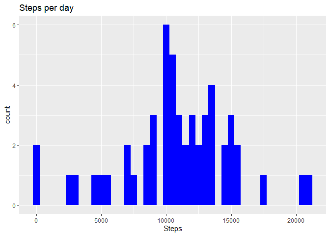
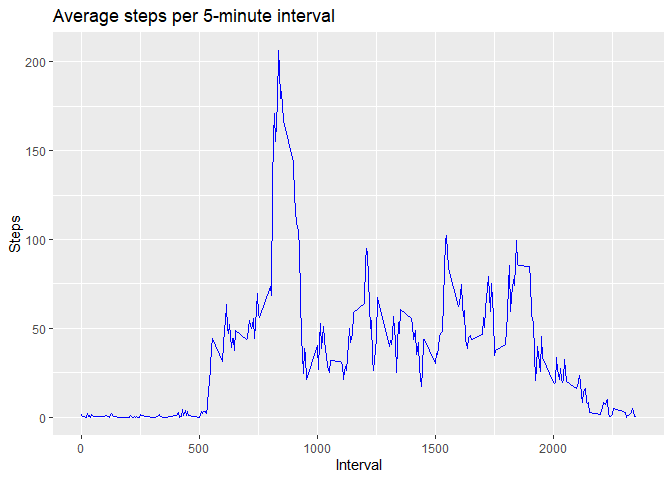
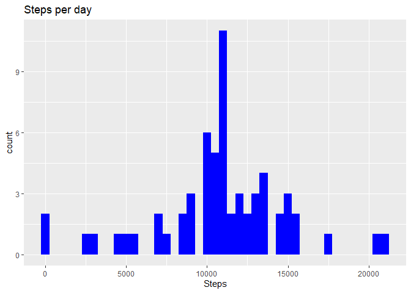
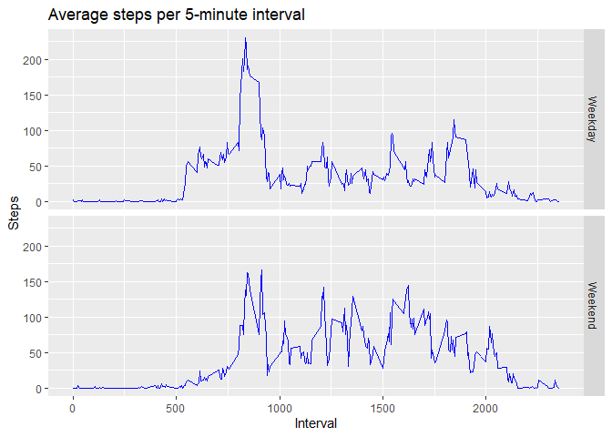

This report shows some characteristics of a person's activity based on measurements from a personal activity monitoring device. The device collects the number of steps taken in five-minute intervals during the months of October and November, 2012.

The source data consists of 3 variables:

* steps: The number of steps in a 5-minute interval
* date: The day of the measurement
* interval: The 5-minute interval

## Loading the data

This code loads the data and the dplyr and ggplot2 packages used for the analysis:


```r
setwd("R/RepData_PeerAssessment1")
data <- read.csv(unz("activity.zip", "activity.csv"))
library(dplyr)
library(ggplot2)
```

## What is mean total number of steps taken per day?

Here is an histogram, along with the code to generate it, of the total steps per day. It takes the source data, groups it by day, obtains the total of steps per day and generates the graph.


```r
by_date <-
    data %>%
        group_by(date) %>%
            mutate(steps_sum=sum(steps)) %>%
                summarize(rank=which.max(steps_sum),steps_date=steps_sum[rank],
                .groups="drop")

g <- ggplot(by_date, aes(steps_date))
g + geom_histogram(fill="blue",binwidth=500) + labs(title="Steps per day",x="Steps")
```

<!-- -->

This code obtains the mean and median of the daily number of steps:


```r
steps_mean <- mean(by_date$steps_date)
steps_median <- median(by_date$steps_date)
```

The mean is **10766.19** and the median is **10765**.

## What is the average daily activity pattern?

The average daily pattern of number of steps is shown in this plot:


```r
by_interval <-
    data %>%
        group_by(interval) %>%
            mutate(steps_avg=mean(steps,na.rm=TRUE)) %>%
                summarize(rank=which.max(steps_avg),steps_interval=steps_avg[rank],
                .groups="drop")

g <- ggplot(by_interval, aes(x=interval, y=steps_interval))
g + geom_line(color="blue") + labs(title="Average steps per 5-minute interval",
    x="Interval", y="Steps")
```

<!-- -->

```r
# Obtain the interval where the maximum number of steps occur.
interval_max <- arrange(by_interval,desc(steps_interval))$interval[1]
steps_max <- round(arrange(by_interval,desc(steps_interval))$steps_interval[1])
```

By looking at the average daily pattern, we find that the 5-minute interval where the maximum number of steps is taken is the one at **835**, with **206** steps.

## Inputing missing values.


```r
nas <- sum(is.na(data$steps))
records <- length(data$steps)
```

The source data has **2304** missing values, out of **17568** records.

To fill in all the missing values, I used the average for a given interval across all days; i.e., if a value is missing for interval 1200 on day 1 and the average value for interval 1200 across all days is X, I used X as the value for Day 1 Interval 1200. A new data set was created with these artificially input values:


```r
data2 <- data

for(i in seq(from = 1, to = nrow(data2))) {
    if(is.na(data2$steps[i])) {
        data2$steps[i] <- filter(by_interval, interval == data2$interval[i])$steps_interval
    }
}
```

Here is an histogram using the new data set, along with the code to generate it, of the total steps per day:


```r
by_date2 <-
    data2 %>%
        group_by(date) %>%
            mutate(steps_sum=sum(steps)) %>%
                summarize(rank=which.max(steps_sum),steps_date=steps_sum[rank],
                .groups="drop")

g <- ggplot(by_date2, aes(steps_date))
g + geom_histogram(fill="blue",binwidth=500) + labs(title="Steps per day",x="Steps")
```

<!-- -->

```r
steps_mean <- mean(by_date2$steps_date)
steps_median <- median(by_date2$steps_date)
```

The new mean is **10766.19** and the new median is **10766.19**. As we can see, the difference against the original data is neglectable.

## Are there differences in activity patterns between weekdays and weekends?

A new variable was created to indicate whether the date is a weekday or a weekend. The data set with no missing values was used.


```r
data2 <- mutate(data2,weekday=as.factor(weekdays(as.Date(date))))
data2 <- mutate(data2,weekday=ifelse((weekday == "Saturday" | weekday == "Sunday"),
        "Weekend","Weekday"))
```

We then obtain the interval plot for each category, weekday or weekend, and look for differences in the patterns:


```r
by_interval2 <-
    data2 %>%
        group_by(interval,weekday) %>%
            mutate(steps_avg=mean(steps,na.rm=TRUE)) %>%
                summarize(rank=which.max(steps_avg),steps_interval=steps_avg[rank],
                weekday_interval=weekday[rank],.groups="drop")

g <- ggplot(by_interval2, aes(x=interval, y=steps_interval))
g + geom_line(color="blue") +
    labs(title="Average steps per 5-minute interval", x="Interval", y="Steps") +
    facet_grid(weekday_interval ~ .)
```

<!-- -->

## Conclusion

We can see that the peak of activity is around 8:30 regardless if it is a weekday or weekend; however, we clearly see that the activity is lower during "working hours" on weekdays compared to the same period on weekends. There is also more activity after 20:00 on weekends.
